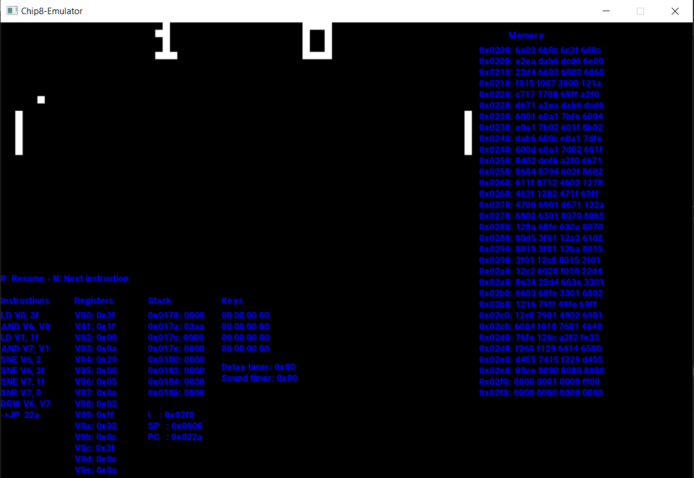
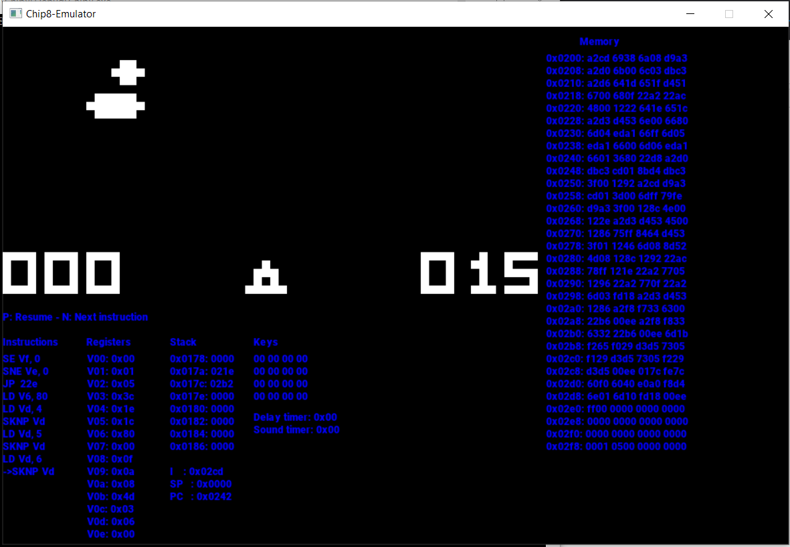
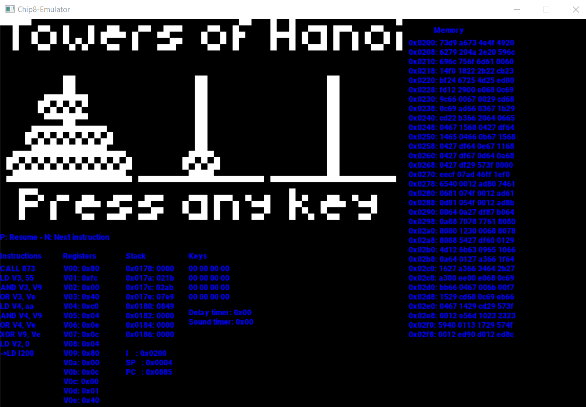

# Chip-8 emulator
- A Chip-8 emulator in C++.
- Use SDL2 to simulate screen. 

## Examples

*Pong*

*UFO*

*HaNoi*

## References
- http://en.wikipedia.org/wiki/CHIP-8
- https://bisqwit.iki.fi/jutut/kuvat/programming_examples/chip8/